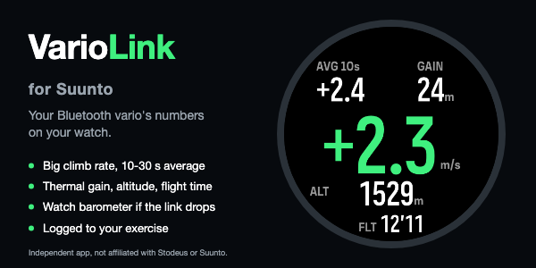
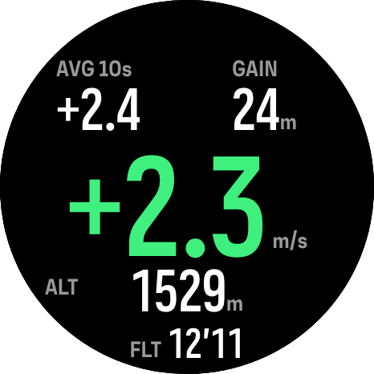
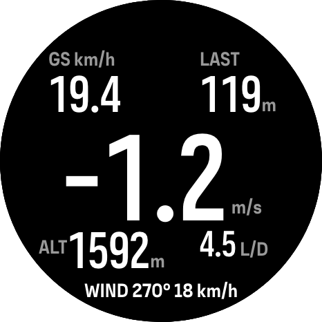
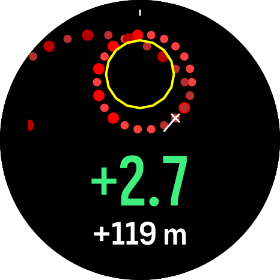

# VarioLink for Suunto



_Independent app, not affiliated with or endorsed by Stodeus or Suunto._

**VarioLink for Suunto** is a SuuntoPlus sports app that shows a **Stodeus UltraBip or BlueBip Bluetooth vario** on a Suunto watch: the climb rate in big numbers, average climb, thermal gain, altitude and flight time, logged to the exercise. Optional thermal pages add ground speed, glide ratio, the wind from your circles and a map of your thermal.

**Status (2026-10-05):** the classic page runs on a Suunto Race S (fw 2.53.42) with an UltraBip: it connects about 3 s after the vario is found and reads every line. The thermal pages (GLIDE, and THERMAL with the map) are built and tested in the simulator; their watch run is next, because they need about 47 KB of the watch's JavaScript memory. Not yet in the SuuntoPlus store.

**Author:** O. Vitya

## What it looks like

<table>
  <tr>
    <td width="33%" valign="top"><br/><strong>Classic page</strong> (default). The climb rate, average climb, thermal gain, altitude and flight time.</td>
    <td width="33%" valign="top"><br/><strong>GLIDE</strong> (beta). Ground speed, climb gain (LAST after a climb), glide ratio, altitude and the wind from your circles.</td>
    <td width="33%" valign="top"><br/><strong>THERMAL</strong> (beta). Your last circles as dots, bigger and redder in stronger lift, fading with age; the yellow ring is the estimated core.</td>
  </tr>
</table>

Simulator screenshots (Race S, 466 px) with demo data.

Store files: [banner](store/ble_vario/upload/1-banner-600x300.png) (600×300), [app image](store/ble_vario/upload/2-app-image-466.png) (466×466) and the [source package](store/ble_vario/upload/3-package-variol-source-v1.1.zip); listing text and FAQ in [store/ble_vario/listing.md](store/ble_vario/listing.md).

## Settings

Set in the Suunto app (a sideloaded build uses the defaults in `data.json`):

| Setting | Values | Default |
|---|---|---|
| Vario model | UltraBip, BlueBip | UltraBip |
| Vario name (optional) | the part of the vario's Bluetooth name after the parachute, e.g. your BipLink pilot name | empty |
| Altitude reference | match watch altitude, watch sea-level pressure (QNH), standard (QNE) | match watch |
| Average climb window | 10, 15, 20, 30 s | 10 s |
| Show sink in red below | off, -1.5 to -3.5 m/s | -3.0 m/s |
| Bottom line | flight time, vario GPS speed and course | flight time |
| Pages | automatic glide/thermal (only app in its sport mode), classic single page | classic |

## Layout

| Path | What |
|---|---|
| `src/ble_vario/` | The app: `main.js` (BLE link, NMEA parser, flight logic, screen), `ext1-5.js` (search filters, UUID registration, summary, demo feed, settings), `ext6-9.js` (XC engine: GPS velocity and circling, wind fit, statistics and pages, texts), `v.html` (template and thermal map), manifest, settings, strings |
| `test/ble_vario/` | `run.js` (74 tests incl. the recorded UltraBip stream, synthetic XC tracks, minified-vs-source and memory checks), `variant.js` (debug, demo and hardware-check builds), `mem/` (sp-mem scenarios) |
| `docs/ble_vario/` | `SPEC.md` (hardware results and decisions at the top), `XC_FEATURES.md`, `HARDWARE_TEST.md`, screenshots, design experiments |
| `docs/research/` | UltraBip protocol, BLE on SuuntoPlus, store, XC instrument research (thermal maps, gain rules), the UltraBip capture |
| `docs/probe/` | Conclusions of the discovery probes (removed from the tree) |
| `store/ble_vario/` | Store listing and upload files |
| `tools/` | `ultrabip_capture.py` (Mac-side capture), thin wrappers of the shared tooling |

## Build and test

```bash
node test/ble_vario/run.js
node test/ble_vario/variant.js dbg <deploy-folder> sn=<pilot name> pg=0
```

Deploy through the bridge from **one fixed folder**: the watch assigns the app ID per source folder, so a new folder installs a second "VarioLink for Suunto". Developer notes (architecture, watch limits, how to extend it): [DEVELOPMENT.md](DEVELOPMENT.md).

## Related projects

- [suuntoplus-agentic-dev-env](https://github.com/aabbeell/suuntoplus-agentic-dev-env): command-line and agent tooling for building, deploying and debugging SuuntoPlus apps
- [Suuntopo](https://github.com/aabbeell/suuntopo): climbing topos on the watch, with a [browser topo editor](https://topo-editor.vercel.app)
- [AirTemp for Suunto](https://github.com/aabbeell/suunto-airtemp): air temperature and humidity from a Bluetooth sensor off your wrist
